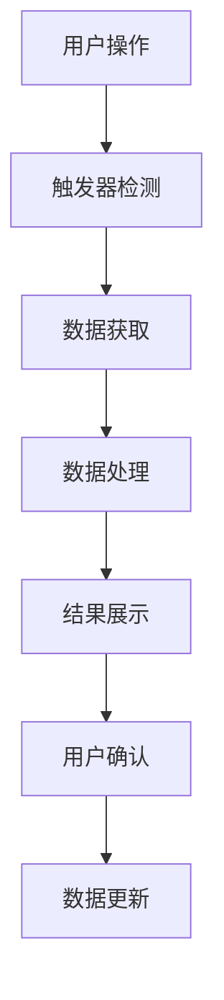

# Google Sheets Helper - Wiki 文档

## 📋 目录

- [项目概述](#项目概述)
- [功能特性](#功能特性)
- [架构设计](#架构设计)
- [安装使用](#安装使用)
- [功能详解](#功能详解)
- [API 文档](#api-文档)
- [开发者指南](#开发者指南)
- [故障排除](#故障排除)
- [开发计划](#开发计划)
- [常见问题](#常见问题)

---

## 🚀 项目概述

Google Sheets Helper 是一个基于 Google Apps Script 的强大工具集，专门用于解决多人协作中 Google Sheets 配置表的版本管理问题。该工具提供了类似 Git 的工作流程，让策划、运营等非技术人员也能轻松管理配置表的版本控制。

### 核心价值

- **版本管理**: 为 Google Sheets 提供类似 Git 的分支管理功能
- **冲突解决**: 智能检测和解决多人协作中的数据冲突
- **可视化对比**: 直观的表格差异显示，类似代码对比工具
- **数据完整性**: ID 冲突检查，确保数据引用的正确性
- **易于使用**: 图形界面操作，无需技术背景

### 应用场景

1. **游戏配置表管理**: 角色配置、道具配置、关卡配置等
2. **运营数据管理**: 活动配置、商品信息、用户权限等
3. **多人协作项目**: 需要多个策划同时编辑配置的项目
4. **数据审核流程**: 配置修改的审核和合并流程

---

## ✨ 功能特性

### 🔄 分支管理
- **创建分支**: 从主表创建独立的工作副本
- **分支对比**: 可视化显示分支与主表的差异
- **智能合并**: 自动检测冲突并提供解决方案
- **合并预览**: 合并前预览所有变更

### 🔍 数据对比
- **逐行对比**: 精确到单元格级别的差异检测
- **颜色标识**: 
  - 🟢 **新增数据** - 浅绿色背景
  - 🔵 **修改数据** - 浅蓝色背景
  - 🔴 **删除数据** - 浅红色背景
  - 🟡 **表头变更** - 浅黄色背景

### 🛡️ 数据完整性
- **ID 冲突检查**: 自动检测表格中重复的 ID
- **引用完整性**: 确保配置间的引用关系正确
- **数据验证**: 合并前的数据格式检查

### 🔧 工具函数
- **Base64 编解码**: 支持批量处理和自定义字符集
- **缓存管理**: 提高表格操作性能
- **注释系统**: 系统级注释和用户注释分离管理

---

## 🏗️ 架构设计

### 核心模块

```
src/
├── Code.gs              # 核心工具函数
├── Constants.gs         # 系统常量和配置
├── Triggers.gs          # 事件触发器
├── IdChecker.gs         # ID 冲突检查器
├── Compare.gs           # 分支对比模块
├── CompareDialog.html   # 对比界面
├── Merge.gs             # 分支合并模块
├── MergeDialog.html     # 合并界面
└── appsscript.json      # Apps Script 配置
```

### 设计原则

1. **模块化设计**: 每个功能独立成模块，便于维护和扩展
2. **缓存优化**: 使用 Google Apps Script 缓存提高性能
3. **错误处理**: 完善的异常处理和用户友好的错误提示
4. **可扩展性**: 预留接口，支持未来功能扩展

### 数据流程



---

## 📦 安装使用

### 方式一：Google Workspace Marketplace（推荐）

1. 打开 Google Sheets
2. 点击 "Extensions" > "Add-ons" > "Get add-ons"
3. 搜索 "Google Sheets Helper"
4. 点击安装并授权

### 方式二：手动部署

1. **克隆项目**
   ```bash
   git clone https://github.com/your-repo/google-sheets-helper.git
   cd google-sheets-helper
   ```

2. **安装 clasp**
   ```bash
   npm install -g @google/clasp
   clasp login
   ```

3. **创建 Apps Script 项目**
   ```bash
   clasp create --type sheets --title "Google Sheets Helper"
   ```

4. **部署代码**
   ```bash
   clasp push
   ```

### 初始配置

1. 在 Google Sheets 中刷新页面
2. 在菜单栏会出现 "Google Sheets Helper" 选项
3. 首次使用需要授权访问权限

---

## 🎯 功能详解

### 分支对比功能

#### 使用步骤
1. 选择要对比的两个表格页签
2. 点击 "开始对比" 按钮
3. 系统会自动标识出差异项
4. 查看对比结果并确认修改

#### 对比规则
- **数据匹配**: 基于行号和列号进行精确匹配
- **智能识别**: 自动识别表头变更和数据修改
- **性能优化**: 大表格分批处理，避免超时

### 分支合并功能

#### 合并策略
1. **新增数据**: 直接添加到目标表格
2. **修改数据**: 检查是否存在冲突
3. **删除数据**: 需要手动确认处理
4. **冲突处理**: 提供多种解决方案

#### 冲突解决
- **自动解决**: 基于时间戳的简单冲突解决
- **手动选择**: 用户可以选择保留哪个版本
- **合并标记**: 记录合并历史和冲突解决方案

### ID 冲突检查

#### 检查范围
- 全表格扫描所有包含 "_INT_id" 后缀的列
- 跨页签检查，确保全局唯一性
- 实时检查，新增 ID 时自动验证

#### 处理方式
- **标红显示**: 冲突的 ID 会被标红
- **批量修复**: 提供批量重新分配 ID 的功能
- **历史记录**: 记录 ID 变更历史

---

## 📚 API 文档

### 核心函数

#### Base64 编解码

```javascript
/**
 * Base64 编码
 * @param {any} input - 输入数据
 * @param {boolean} OPT_webSafe - 是否使用 Web 安全变体
 * @param {boolean} OPT_plainText - 是否作为纯文本处理
 */
function base64Encode(input, OPT_webSafe, OPT_plainText)

/**
 * Base64 解码
 * @param {any} input - 输入数据
 * @param {boolean} OPT_webSafe - 是否使用 Web 安全变体
 * @param {boolean} OPT_plainText - 是否作为纯文本处理
 */
function base64Decode(input, OPT_webSafe, OPT_plainText)
```

#### 表格信息获取

```javascript
/**
 * 获取表格信息（带缓存）
 * @returns {Object} 包含所有表格名称和当前表格的对象
 */
function getSheetInfo()

/**
 * 获取当前页签名称
 * @returns {string} 当前页签名称
 */
function getCurrentSheetName()

/**
 * 获取当前页签A1单元格的注释
 * @returns {string} A1单元格的注释内容
 */
function getCurrentSheetA1Note()
```

### 常量配置

#### 颜色常量
```javascript
const SHEET_CONSTANTS = {
  COLORS: {
    MODIFIED: "#b3e5fc",    // 修改 - 浅蓝色
    ADDED: "#dcedc8",       // 新增 - 淡绿色
    HEADER_MODIFIED: "#fff9c4", // 表头修改 - 浅黄色
    CONFLICT: "#f8bbd0"     // 冲突 - 粉色
  }
};
```

#### 合并常量
```javascript
const MERGE_CONSTANTS = {
  ID_SUFFIX: '_INT_id',
  CONFLICT_PREFIX: '冲突: ',
  PREVIEW_SUFFIX: '_预览'
};
```

---

## 👨‍💻 开发者指南

### 开发环境设置

1. **安装开发工具**
   ```bash
   npm install -g @google/clasp
   npm install -g typescript
   ```

2. **项目结构**
   ```
   google-sheets-helper/
   ├── src/                 # 源码目录
   ├── .clasp.json         # clasp 配置
   ├── cursorrule.json     # 开发规则
   └── README.md           # 项目说明
   ```

3. **本地开发**
   ```bash
   # 拉取远程代码
   clasp pull
   
   # 推送本地代码
   clasp push
   
   # 在浏览器中打开项目
   clasp open
   ```

### 代码规范

#### 函数命名
- 使用驼峰命名法
- 函数名应该描述其功能
- 避免使用缩写

#### 注释规范
```javascript
/**
 * 函数功能描述
 * @param {type} paramName - 参数描述
 * @returns {type} 返回值描述
 */
function functionName(paramName) {
  // 实现逻辑
}
```

#### 错误处理
```javascript
try {
  // 主要逻辑
} catch (error) {
  console.error('错误描述:', error);
  throw new Error("用户友好的错误信息");
}
```

### 测试指南

#### 单元测试
- 每个核心函数都应该有对应的测试
- 使用 Google Apps Script 的内置测试功能
- 测试覆盖正常情况和异常情况

#### 集成测试
- 在真实的 Google Sheets 环境中测试
- 测试多用户协作场景
- 验证权限和安全性

---

## 🔧 故障排除

### 常见问题

#### 1. 权限问题
**问题**: 提示没有访问权限
**解决方案**:
- 检查是否已授权所有必要权限
- 重新授权：Extensions > Apps Script > 重新授权

#### 2. 性能问题
**问题**: 大表格处理缓慢
**解决方案**:
- 启用缓存功能
- 分批处理大量数据
- 避免在高峰期进行大量操作

#### 3. 数据同步问题
**问题**: 多人同时编辑时数据冲突
**解决方案**:
- 使用分支功能
- 定期进行数据备份
- 遵循协作规范

### 调试技巧

1. **查看日志**
   ```javascript
   console.log('调试信息:', variable);
   ```

2. **使用断点**
   - 在 Apps Script 编辑器中设置断点
   - 逐步执行代码

3. **异常监控**
   - 启用 Stackdriver 日志记录
   - 监控异常报告

---

## 📅 开发计划

### 已完成功能
- ✅ Base64 编解码函数
- ✅ 页签对比功能
- ✅ 页签合并功能  
- ✅ ID 冲突检查

### 进行中功能
- 🔄 SQL 查询功能
  - 分支导入 MySQL 数据库
  - 实现界面 SQL 语句查找引用错误

### 计划功能
- 📋 数据审核工作流
- 📋 批量操作工具
- 📋 配置模板管理
- 📋 历史版本回滚
- 📋 权限管理系统

### 版本规划

#### v2.0 (计划)
- SQL 查询功能完善
- 性能优化
- 用户界面改进

#### v2.1 (计划)
- 数据导入导出功能
- 更多格式支持
- 移动端优化

---

## ❓ 常见问题

### Q: 如何备份我的配置表？
A: 可以使用 Google Sheets 的内置备份功能，或者导出为 Excel 格式保存本地。

### Q: 支持哪些数据格式？
A: 支持所有 Google Sheets 支持的数据格式，包括文本、数字、日期、公式等。

### Q: 如何处理大表格的性能问题？
A: 系统已内置缓存和分批处理机制，对于超大表格建议分表处理。

### Q: 是否支持自定义函数？
A: 支持，可以在 Code.gs 中添加自定义函数，或者提交功能请求。

### Q: 如何参与开发？
A: 欢迎提交 Issue 和 Pull Request，详见项目的 GitHub 仓库。

---

## 📞 支持与反馈

- **GitHub Issues**: [项目问题追踪](https://github.com/your-repo/google-sheets-helper/issues)
- **功能请求**: 通过 GitHub Issues 提交
- **Bug 报告**: 请提供详细的复现步骤

---

## 📄 许可证

本项目采用 MIT 许可证，详见 LICENSE 文件。

---

*最后更新: 2024年12月* 